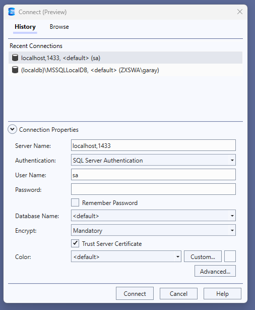

En caso de no tener instalado sql server en la maquina se levnatara el proyecto, favor de utilizar dbeaver, para ejecturar script 

## Levantamiento rápido de la base de datos con Docker

1. Instala [Docker](https://www.docker.com/get-started).
2. En la raíz del repositorio, ejecuta:

   ```bash
   docker-compose up -d
   ```

3. La base de datos SQL Server estará disponible en el puerto **1433**.  
   - Usuario: `sa`
   - Contraseña: `SuperSecret123!`

4. El script `sql-scripts/create_usuario_table.sql` se debe ejecutar, utilizar los parametros del punto 5, como referencia se adjunta fotografia



5. Conecta tu backend .NET usando la cadena de conexión:

   ```
   Server=localhost,1433;Database=master;User Id=sa;Password=SuperSecret123!;
   ```
6. ¡Listo para usar!


notas:

aceptamos termino y condiciones
      ACCEPT_EULA: "Y" 

creamos un volumen dentro de la ruta del contendedor
  volumes:
      - ./sql-scripts:/docker-entrypoint-initdb.d